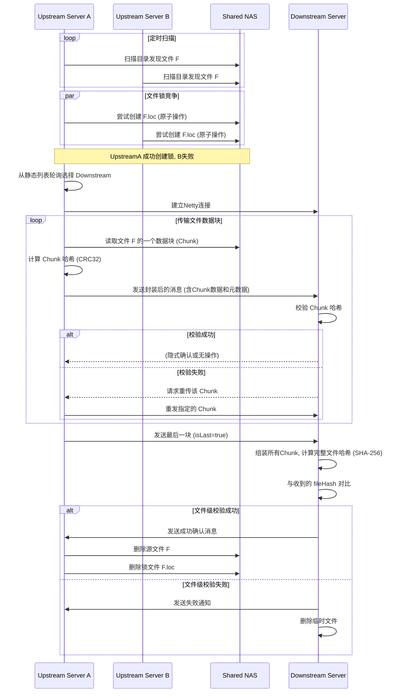

# 基于Netty的多对多分布式文件传输系统

## 1. 项目目标

本项目旨在开发一套高效、健壮、支持并发和负载均衡的分布式文件传输系统。系统由多个上游生产者服务（Upstream Server）和多个下游消费者服务（Downstream Server）组成，通过Netty实现底层通信，确保在多节点、大文件、高并发场景下文件能够被可靠、不重复、高效地传输。

## 2. 核心技术决策

根据初步讨论，项目将采用以下技术方案：
- **构建工具**: Apache Maven
- **所有者ID (`owner` ID)**: 每个Upstream Server在各自的配置文件中进行静态指定。
- **块重传机制**: 采用简单的“暂停-重传”模式。当一个数据块校验失败时，下游请求重传，上游暂停当前文件的正常发送，优先处理重传请求。

## 3. 项目架构

项目将采用多模块Maven结构，以实现关注点分离和代码复用。

```
netty-demo/
├── pom.xml                   (父POM)
├── .gitignore
├── README.md
├── netty-demo-common/        (通用模块)
│   ├── src/main/java
│   └── pom.xml
├── netty-demo-downstream/    (Downstream Server实现)
│   ├── src/main/java
│   └── pom.xml
└── netty-demo-upstream/      (Upstream Server实现)
    ├── src/main/java
    └── pom.xml
```

- **`netty-demo-common`**: 存放通用的代码，如协议消息类(POJO)、常量、哈希工具类等。
- **`netty-demo-downstream`**: Downstream Server 的实现，负责接收和处理文件。
- **`netty-demo-upstream`**: Upstream Server 的实现，负责监控、竞争和发送文件。

## 4. 核心文件传输流程



## 5. 分阶段实施计划

1.  **第一阶段：项目骨架与核心模型定义**
    *   [ ] 使用Maven初始化多模块项目结构。
    *   [ ] 在 `netty-demo-common` 模块中，创建文件传输协议的POJO（`FileChunk.java`）。
    *   [ ] 定义配置文件模板（`application.properties`），包含所有可配置参数。

2.  **第二阶段：Downstream Server 基础功能实现**
    *   [ ] 实现Netty Server的启动逻辑。
    *   [ ] 设计 `ChannelPipeline`，包含编解码器和核心业务逻辑处理器。
    *   [ ] 实现数据块的接收、块级哈希校验、写入临时文件。
    *   [ ] 实现文件级哈希校验和最终文件的持久化。
    *   [ ] 将耗时的I/O操作从Netty的I/O线程中剥离到业务线程池。

3.  **第三阶段：Upstream Server 核心传输逻辑**
    *   [ ] 实现Netty Client的连接逻辑。
    *   [ ] 实现文件扫描和原子性的锁竞争机制。
    *   [ ] 实现文件分块、计算哈希和按顺序发送数据块的逻辑。

4.  **第四阶段：实现健壮性与高级特性**
    *   [ ] **心跳机制**: 在两端的 `ChannelPipeline` 中加入 `IdleStateHandler`。
    *   [ ] **故障转移**: 实现连接失败后自动尝试列表中的下一个节点。
    *   [ ] **僵尸锁处理**: 实现对超时锁的检查与强制接管。
    *   [ ] **块级重传**: 实现简单的请求-重传协议。
    *   [ ] **背压机制**: 配置并测试Netty的写水位线。
    *   [ ] **幂等性处理**: 在下游增加对文件是否已存在的检查。

5.  **第五阶段：集成、测试与文档**
    *   [ ] 完善所有可配置项的加载逻辑。
    *   [ ] 编写单元测试和集成测试，覆盖所有验收标准。
    *   [ ] 完善本文档，补充配置和运行说明。